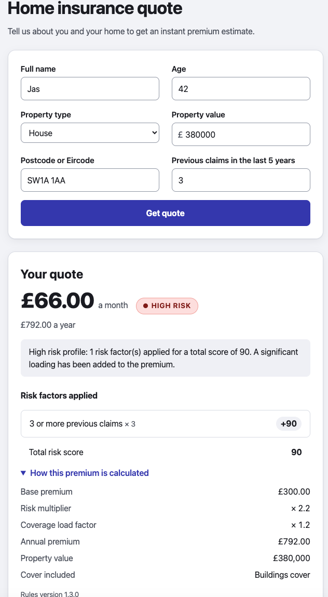
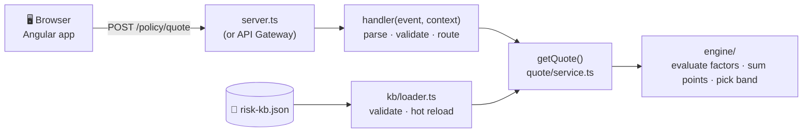

<div align="center">

# 🏠 PolicyQuote

### Policy Risk & Premium Engine

A single-page home insurance quote tool whose **risk rules live entirely in a JSON Knowledge Base**.<br>
Adding, changing or removing a risk factor is a KB edit, never a code change.

[](frontend)
[](backend)
[](backend/tsconfig.json)
[](backend/src/quote/request.ts)
[](#tests)
[](docker-compose.yml)

**[Quick start](#quick-start)** · **[How it works](#how-it-works)** · **[API](#api)** · **[Knowledge Base](#knowledge-base)** · **[Changing the rules](#changing-the-rules)** · **[Versioning](#kb-versioning)**

</div>

---

## ✨ Highlights

- 📘 **Knowledge Base driven.** Every score, threshold, multiplier and premium input is in [`risk-kb.json`](risk-kb.json) at the repo root. The engine has no numbers of its own.
- 🧩 **Table-driven engine.** Conditions are data: single-field rules, or `all` / `any` / `not` groups nested to any depth. Operators come from a registry, never a `switch`.
- ⚡ **Hot reload.** Edit the KB and the next quote uses it, with no restart. An invalid edit is rejected with the exact JSON path, and the last good KB keeps serving.
- λ **Lambda-style backend.** `handler(event, context)` with no AWS dependency, run locally by a thin `node:http` adapter.
- 🅰️ **Angular signals.** Standalone, zoneless and OnPush, with a Reactive Form and hand-written CSS (no UI libraries).
- 🇬🇧 🇮🇪 **UK and Ireland.** A UK postcode or an Irish Eircode; the postcode picks £ or €.
- 🏷️ **Versioned rules.** Every quote returns the `kbVersion` that priced it, and a breaking KB change is rejected rather than served.

---

## 📸 What it looks like

<p align="center">
  
</p>

A customer fills in the six fields from the brief and gets an instant quote. The example is a **£380,000 house in London (`SW1A 1AA`) with 3 previous claims** in the last 5 years. Here is where each part of the result comes from:

| On screen | Where it comes from |
|---|---|
| **£** throughout | The postcode is a UK postcode, so the currency is GBP. The value field switches to £ while the postcode is typed; an Eircode would give €. |
| **3 or more previous claims × 3 · +90** | The only matching KB factor, `previous_claims_high`. It is a `perOccurrence` factor: 30 points × 3 claims = **90**. |
| **HIGH RISK** badge and summary | 90 falls in the KB's `HIGH_RISK` band (61+). The badge shows the band's `label`, and the summary is its template filled in with the score and factor count. |
| **£66.00 a month · £792.00 a year** | The brief's formula: base premium £300 × risk multiplier 2.2 × coverage load factor 1.2 = £792 a year. The breakdown under "How this premium is calculated" shows each input. |
| **Rules version 1.3.0** | The KB `version` that priced this quote, so any quote can be traced back to the rules in force. |

> [!NOTE]
> None of the wording on the result (factor text, badge label or summary) is in the frontend code. It all arrives in the API response from `risk-kb.json`, so a new factor appears here with no frontend change.

---

<a id="quick-start"></a>

## 🚀 Quick start

> [!IMPORTANT]
> Requires **Node.js 22 or 24 LTS**. Docker is optional.

| Run | Command | Open |
|---|---|---|
| **Both services** (recommended) | `npm start` from the repo root | http://localhost:4200 |
| **Backend only** | `npm --prefix backend install && npm --prefix backend start` | http://localhost:3000 |
| **Frontend only** | `npm --prefix frontend install && npm --prefix frontend start` | http://localhost:4200 |
| **Docker** | `docker compose up --build` (stop with `docker compose down`) | http://localhost:8080 |

- **`npm start`** runs [`scripts/start.mjs`](scripts/start.mjs), which has no dependencies. On the first run it installs each package's dependencies (`npm ci`). It shows both services' output with `[backend]` / `[frontend]` prefixes, and stops both on Ctrl+C or when either one exits.
- **Each package also starts on its own**, as the brief requires. The frontend dev server proxies `/policy` and `/health` to the backend on :3000.

> [!TIP]
> Under Docker the UI is on **:8080**, not :4200. Port 4200 is only used by `npm start`.

<details>
<summary><b>🐳 What the Docker setup does</b></summary>

- `backend/Dockerfile` is a multi-stage, Fargate-ready image: non-root, configured by environment variables, with only production dependencies and a `HEALTHCHECK` on `GET /health` (which returns the active KB version). It runs locally only.
- `frontend/Dockerfile` builds Angular and serves it with nginx, which proxies `/policy` and `/health` to the backend, so the browser stays same-origin.
- Compose mounts the repo root **read-only** at `/app/kb`, so `KB_PATH=/app/kb/risk-kb.json` is the live file. Edit `risk-kb.json` on the host and the next quote uses it: no rebuild, no restart.

</details>

### Try a quote

Sample requests are in [`backend/requests/`](backend/requests): one per band (`standard`, `elevated`, `high-risk`), plus the `compound` and `flood-zone` demos. `standard` and `high-risk` use UK postcodes; the others use Eircodes.

```bash
curl -s -XPOST localhost:3000/policy/quote -H 'Content-Type: application/json' -d @backend/requests/high-risk.json
```

---

<a id="tests"></a>

## 🧪 Tests

```bash
npm --prefix backend test    # Jest: engine, loader, handler, KB-driven scenarios, configurability proof
npm --prefix frontend test   # Vitest: form validators, signal state, result panel, badge
```

The backend tests are mostly **data**: each KB factor has a JSON scenario file in [`backend/test/scenarios/`](backend/test/scenarios), with its expected score worked out by hand. A coverage test fails if any factor or band has no scenario.

---

<a id="how-it-works"></a>

## 🧭 How it works



| Folder (`backend/src`) | Responsibility |
|---|---|
| `handler.ts`, `http/` | **Protocol only:** the Lambda entry point, route table, CORS and error mapping. No scoring. |
| `server.ts` | **Local adapter** from `node:http` to the handler, plus the KB file watcher. No routing or validation. |
| `quote/` | **The request contract** (Zod), postcode → currency, and `getQuote`: the brief's premium formula. |
| `engine/` | **Pure scoring:** the operator registry, the condition evaluator, points and band lookup. No numbers of its own. |
| `kb/` | **The Knowledge Base:** types, schema, loader (six checks, each naming the JSON path), hot reload and the Lambda refresh. |

The frontend ([`frontend/src/app`](frontend/src/app)) is one standalone page. `quote/quote-page.component` holds the form and the three state signals (`loading`, `quoteResult`, `errorMessage`), `quote-result.component` renders the quote, and `risk-band-badge` is the reusable badge. See the [frontend README](frontend/README.md) for a file-by-file table.

---

<a id="api"></a>

## 🔌 API

| Method | Path | Purpose |
|---|---|---|
| `POST` | `/policy/quote` | Price a quote: the brief's six request fields in, the brief's seven response fields out, plus `currency`, `riskBandLabel` and `kbVersion`. |
| `GET` | `/health` | Liveness: `{ status, kbVersion, schemaVersion, factorCount }`. |

**Request fields**

| Field | Rule |
|---|---|
| `customerName` | 1–100 characters. Collected, but never scored. |
| `age` | Integer, 18–120. |
| `propertyType` | `House`, `Flat` or `Bungalow`. |
| `propertyValue` | Greater than 0, in the postcode's currency. |
| `postcode` | A UK postcode or an Irish Eircode; upper-cased. |
| `previousClaims` | Integer, 0–20, in the last 5 years. |

```bash
curl -s -XPOST localhost:3000/policy/quote -H 'Content-Type: application/json' \
  -d '{ "customerName": "Cara Compound", "age": 40, "propertyType": "Flat", "propertyValue": 600000, "postcode": "SW1A 1AA", "previousClaims": 0 }'
```

<details>
<summary><b>📄 Full response</b></summary>

```json
{
  "monthlyPremium": 45, "annualPremium": 540, "currency": "GBP",
  "riskBand": "ELEVATED", "riskBandLabel": "ELEVATED", "riskScore": 45,
  "riskSummary": "Elevated risk profile: 2 risk factor(s) applied for a total score of 45. A loading has been added to the premium.",
  "coverageDetails": { "basePremium": 300, "riskMultiplier": 1.5, "coverageLoadFactor": 1.2, "sumInsured": 600000,
                       "items": [{ "id": "buildings", "description": "Buildings cover" }] },
  "appliedFactors": [
    { "id": "property_type_flat", "description": "Flat — higher shared risk", "points": 10, "occurrences": 1 },
    { "id": "flat_high_value", "description": "Flat valued over £500,000 — higher shared-building exposure", "points": 35, "occurrences": 1 }
  ],
  "kbVersion": "1.3.0"
}
```

</details>

**Errors**

| Status | Body | When |
|---|---|---|
| `400` | `{ error, issues: [{ field, message }] }` | Any invalid field, all named at once, e.g. `{ "field": "postcode", "message": "Must be a valid UK postcode or Eircode" }`. |
| `404` | `{ error }` | An unknown route. |
| `500` | `{ error, requestId }` | The KB can't be read. No internal detail is returned; it goes to the server log. |

---

<a id="knowledge-base"></a>

## 📘 The Knowledge Base

[`risk-kb.json`](risk-kb.json) extends the brief's example **without reshaping it**: every key and value from the brief is kept, and additions are new keys only.

| Key | What it holds |
|---|---|
| `version` | The rule-set version, returned as `kbVersion` in every quote and by `/health`. |
| `schemaVersion` | The KB *shape* version, checked by the loader. |
| `basePremium`, `coverageLoadFactor` | The premium formula inputs: `basePremium × riskMultiplier × coverageLoadFactor`. |
| `riskBands` | Score ranges, plus each band's `riskMultiplier`, badge `label` and `summary` template. |
| `factors[]` | `id`, customer-facing `description` (the brief's wording, shown for £), optional `descriptions` (wording per currency, e.g. `{ "EUR": "…€750,000" }`), a `condition`, `points`, optional `perOccurrence` and `enabled`. |

A `condition` is either a **leaf**, `{ "field", "operator", …params }`, or a **group**, `{ "all": [...] }`, `{ "any": [...] }` or `{ "not": {...} }`, nested to any depth. So "Flat AND over £500k" is just data:

```json
{ "id": "flat_high_value", "points": 35, "description": "Flat valued over £500,000 — higher shared-building exposure",
  "descriptions": { "EUR": "Flat valued over €500,000 — higher shared-building exposure" },
  "condition": { "all": [ { "field": "propertyType", "operator": "eq", "value": "Flat" },
                          { "field": "propertyValue", "operator": "gt", "value": 500000 } ] } }
```

| Operators | Params | Notes |
|---|---|---|
| `eq`, `neq` | `value` | Any string, number or boolean. |
| `gt`, `gte`, `lt`, `lte` | `value` | Numbers only. |
| `between` | `min`, `max` | Inclusive at both ends. |
| `outside_range` | `min`, `max` | Exclusive: the bounds themselves don't match. |
| `in` | `values` | Matches any value in the list. |
| `starts_with` | `values` | Case-insensitive prefix, e.g. postcode areas. |

`perOccurrence: true` awards `points × the field's value`, e.g. 2 claims × 15 = 30.

> [!NOTE]
> The backend validates the KB at startup and on every change. A bad KB names the offending path, for example `factors.3.condition.all.1.operator: unknown operator "nope"`.

### 🇬🇧 🇮🇪 UK and Ireland

The `postcode` field accepts a **UK postcode** (e.g. `SW1A 1AA`) or an **Irish Eircode** (e.g. `D02 X285`). The two formats never overlap, so the postcode also picks the currency ([`quote/market.ts`](backend/src/quote/market.ts)):

| Postcode | `currency` | Premiums shown | Factor wording |
|---|---|---|---|
| UK | `GBP` | £ | `description`: the brief's wording, verbatim |
| Eircode | `EUR` | € | `descriptions.EUR` when a factor has one, otherwise `description` |

The KB's numbers are the same in both markets, and amounts aren't converted: €750,000 and £750,000 trip the same factor.

---

<a id="changing-the-rules"></a>

## 🛠️ Changing the rules

Every scoring rule is in `risk-kb.json`. Changing a rule edits **that file and its test fixtures only**: nothing under `backend/src` or `frontend/src` changes, and the running backend picks the edit up within a second.

### 🤖 With the `kb-factor` skill (recommended)

In Claude Code, describe the rule in plain English. Invoke the skill by name, or just describe the rule and it triggers on its own:

```text
/kb-factor add a flood zone factor: +15 if the postcode starts with EX or PL
/kb-factor add a flood zone factor for Eircodes in routing areas T12 or N37, +15
claims penalty should be 20 not 15
pause the flat factor
```

The skill ([`.claude/skills/kb-factor/SKILL.md`](.claude/skills/kb-factor/SKILL.md)) then:

1. **Restates the rule in KB terms** before editing, e.g. `flood_zone: postcode starts_with [EX, PL], +15`. If the wording is ambiguous ("over" or "or more"?), it asks.
2. **Edits `risk-kb.json`** and bumps `version` in one save, so the new rule never goes live under the old version.
3. **Adds or updates a scenario fixture** in `backend/test/scenarios/<id>.json`: one request that triggers the factor, one near-miss that doesn't, and the arithmetic in `why`. For a new factor it also adds a sample request in `backend/requests/<id>.json`.
4. **Proves the change:** the KB loads, `git status` shows nothing changed under `src/`, `npx jest` passes, `/health` shows the new `kbVersion`, a `curl` quote lists the factor, and the UI shows it.
5. **Logs the change** in `AGENT_LOG.md`.

| Change | Example request | What it does to `risk-kb.json` |
|---|---|---|
| ➕ Add | "flood zone postcode prefix EX or PL, +15" | Appends a new entry to `factors[]`. |
| ✏️ Change a weight | "the age factor should be +25" | Edits only `points`; the `id` stays the same. |
| ⏸️ Disable | "pause the flat factor" | Sets `"enabled": false` and keeps the entry. |
| 🗑️ Remove | "drop property_value_high" | Deletes the entry. |
| 🔗 Combine fields | "Flat AND over £500k is +35" | Adds a condition group: `all` (AND), `any` (OR) or `not`. |

> [!WARNING]
> **When the skill stops.** A rule can only read the six request fields and use the operators above. If a rule needs more, the skill says so instead of working around it:
> - a new field (such as `yearBuilt`) goes to the `lambda-handler` skill and the Angular form;
> - a new operator (such as a regex) goes to `risk-engine`;
> - a discount, a multiplier or a new band is a scoring-model change for `risk-engine`.

<details>
<summary><b>✍️ Changing a rule by hand</b></summary>

1. **Edit `risk-kb.json`.**
   - To add a factor, append an entry to `factors[]` with a new snake_case `id`, a customer-facing `description` (the UI shows it verbatim), an integer `points`, and a `condition`.
   - To change a factor, edit only the key that changes and keep its `id`.
   - Set `"enabled": false` to pause a factor, or delete the entry to remove it.
   - Field names and enum values must match the request exactly: `propertyType` is `House`, `Flat` or `Bungalow`.

   ```json
   { "id": "flood_zone_uk", "points": 15, "description": "Property in a flood-risk postcode area",
     "condition": { "field": "postcode", "operator": "starts_with", "values": ["EX", "PL"] } }
   ```

2. **Bump `version` in the same save:** minor (`1.3.0` → `1.4.0`) for a factor added, changed, disabled or removed, and patch for a wording-only change. Leave `schemaVersion` unchanged.
3. **Update the fixtures.**
   - A new factor needs `backend/test/scenarios/<id>.json`, with each expected score worked out by hand. The coverage test fails if a factor has no fixture.
   - A change or removal moves expected scores in existing fixtures. Update them and note which moved and why.
   - The fixture format is described in [`.claude/skills/kb-driven-tests/SKILL.md`](.claude/skills/kb-driven-tests/SKILL.md).
4. **Verify** with the backend still running. Don't restart it, because a restart would hide whether hot reload works.

   ```bash
   npm --prefix backend test
   curl -s localhost:3000/health                          # shows the new kbVersion
   curl -s -XPOST localhost:3000/policy/quote -H 'Content-Type: application/json' \
     -d @backend/requests/<id>.json                       # appliedFactors lists the factor
   ```

   If the edit is invalid, the backend logs an error naming the JSON path and **keeps serving the last good KB**. Fix the file and it reloads.

</details>

---

<a id="kb-versioning"></a>

## 🏷️ KB versioning

Two version numbers do different jobs:

| Field | Tracks | Bumped when |
|---|---|---|
| `version` | **The rules.** Returned in every quote, so each quote records the rule set that priced it. | Any rule changes. Live as soon as the file changes, with no restart or redeploy. |
| `schemaVersion` | **The shape.** The loader lists the shapes it supports (`supportedSchemaVersions`) and rejects any other. | The KB's structure changes in a way old code can't read. |

**Picking up a new KB**, wherever the handler runs:

| Runs as | How a changed `KB_PATH` goes live |
|---|---|
| `npm start` / Docker | `server.ts` watches the file (`fs.watchFile`, stat polling) and reloads within a second. |
| A Lambda container | There's no `server.ts`, so no watcher. Set **`KB_REFRESH_SECONDS`** (e.g. `30`): the handler checks the file at most once per interval and reloads when it changes ([`kb/refresh.ts`](backend/src/kb/refresh.ts)). The KB sits on a mounted file system (such as EFS) that the publishing pipeline writes to, so there's no redeploy and no wait for a cold start. Unset or `0` keeps the KB loaded at cold start. |

Both paths go through the same `reloadKb()`. [`kb/refresh.spec.ts`](backend/src/kb/refresh.spec.ts) drives the handler the way a warm Lambda container would.

**Breaking schema changes, without redeploying:**

- ✅ **Additive changes are backward compatible.** New keys are ignored by code that doesn't know them, so they ship as a normal KB edit with no `schemaVersion` bump.
- 🛡️ **A breaking change can't take the service down.** A KB with an unsupported `schemaVersion` is rejected with `schemaVersion: 2 is not supported (supported: 1)`, and **the last good KB keeps serving**. Quotes never run on rules the code can't interpret ([`kb/versioning.spec.ts`](backend/src/kb/versioning.spec.ts) proves it).
- 🔁 **Rolling out a breaking change uses expand/contract:**
  1. Ship code that reads both N and N+1 (add N+1 to `supportedSchemaVersions`).
  2. Publish the N+1 KB. No deploy is needed; the running service picks it up.
  3. Once nothing publishes N any more, drop N support in a later release.

<details>
<summary><b>🏭 Version-controlled rule sets in production</b></summary>

- The KB lives in git, and each change is a reviewed pull request whose fixtures prove the new scores.
- A pipeline validates it with the same loader the service uses (`parseKb`), runs the scenario tests, and publishes an immutable, versioned artefact (for example `risk-kb/1.4.0.json` in object storage).
- The service is pointed at a version by configuration (`KB_PATH`, or a pinned "current version" pointer), not by a redeploy. Rolling back means pointing at the previous version, and `kbVersion` on every quote gives the audit trail.

</details>

---

## 🗂️ Project layout

```text
risk-kb.json          📘 the Knowledge Base
backend/
├── src/              handler, server, quote/, engine/, kb/, http/  (see "How it works")
├── test/             KB-driven scenario fixtures, configurability proof, coverage check
├── requests/         sample requests for curl and the demo
└── Dockerfile        multi-stage, non-root image with a HEALTHCHECK
frontend/             Angular 22 standalone app: signals, Reactive Forms, hand-written CSS, Dockerfile + nginx.conf
docker-compose.yml    the whole app on :8080 with the KB mounted live
images/               screenshots used in this README
package.json          root npm start: runs both services via scripts/start.mjs (no dependencies)
specs/                mission, tech stack, roadmap, review prep
CLAUDE.md, .claude/   agent instructions and project skills
AGENT_LOG.md          the agent interaction log
SOLUTION.md           design summary
```

---

<div align="center">

**[📝 Solution summary](SOLUTION.md)** · **[🤖 Agent log](AGENT_LOG.md)** · **[📐 Specs](specs)** · **[🅰️ Frontend README](frontend/README.md)**

</div>
