# PolicyQuote Developer Guide

This guide is for engineers who build, change, run or deploy PolicyQuote. It covers the architecture, the use cases, the runtime flows as sequence diagrams, local setup, day-to-day development, and a reference deployment to AWS with Terraform.

For a quick tour of the product, see the [README](../README.md). For the agreed design decisions and the reasons for them, see [`specs/tech-stack.md`](../specs/tech-stack.md). If this guide and the specs disagree, the specs win. The brief wins over both.

> [!NOTE]
> All diagrams are [Mermaid](https://mermaid.js.org/), which GitHub, VS Code (with a Mermaid extension) and most Markdown viewers render inline.

## Contents

1. [System overview](#1-system-overview)
2. [Architecture](#2-architecture)
3. [Use cases](#3-use-cases)
4. [Runtime interaction flows](#4-runtime-interaction-flows)
5. [Setup guide](#5-setup-guide)
6. [Development workflow](#6-development-workflow)
7. [Configuration reference](#7-configuration-reference)
8. [Deploying to AWS with Terraform](#8-deploying-to-aws-with-terraform)
9. [Troubleshooting](#9-troubleshooting)
10. [Appendix: file map](#10-appendix-file-map)

---

## 1. System overview

PolicyQuote is a single-page home insurance quote tool. A customer enters six details about themselves and their property. The backend scores the risk against a **JSON Knowledge Base (KB)**, picks a risk band and prices an annual and monthly premium, then returns a breakdown of every factor that applied.

The KB is the central idea. **Every scoring rule, threshold, multiplier and premium input is in [`risk-kb.json`](../risk-kb.json)**, and the engine has no numbers of its own. Adding, changing or disabling a risk factor is a KB edit that the running service picks up without a restart. It never needs a code change or a deploy.

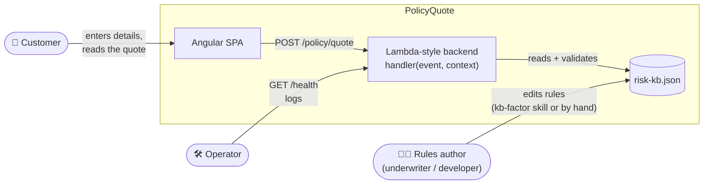

**Key properties**

| Property | How it is achieved |
|---|---|
| Deterministic | The same request and the same KB always give the same quote. The backend makes no network calls, uses no LLM and reads no clock. |
| KB-driven | The engine iterates `factors[]`, evaluates each `condition` through an operator registry, sums the points and looks up the band. It never names a field, factor or band. |
| Safe to change live | Every KB load is validated. An invalid edit is rejected with the JSON path of the problem, and the last good KB keeps serving. |
| Traceable | Every quote carries the `kbVersion` of the rules that priced it. |
| Portable | `handler(event, context)` uses the API Gateway proxy shape. It runs the same way under the local `node:http` adapter, in Docker, or as an AWS Lambda. |

---

## 2. Architecture

### 2.1 Design principles

1. **Rules are data.** Scoring values live only in the KB. Quality gates grep `backend/src/engine` for numeric literals.
2. **Tables, not ladders.** Routes, operators and condition node kinds are resolved through lookup tables. There is no `switch`, and no if/else chain over ids.
3. **Protocol at the edge, pure logic in the middle.** `handler.ts` parses, validates, routes and maps errors. `getQuote()` and `engine/*` are pure functions with no I/O.
4. **One source for each contract.** The request shape is the Zod `quoteRequestSchema`. The KB shape is `kb/types.ts`, and `kb/schema.ts` validates it. The frontend's `models/quote.ts` and form validators mirror the request schema and must change with it.
5. **No `any`.** Untrusted input (request bodies, KB files, error bodies) is parsed as `unknown` and narrowed with Zod or type guards.
6. **Signals for UI state.** The page's `loading`, `quoteResult` and `errorMessage` are Angular signals. Everything else on the page is derived with `computed()`.

### 2.2 Container view

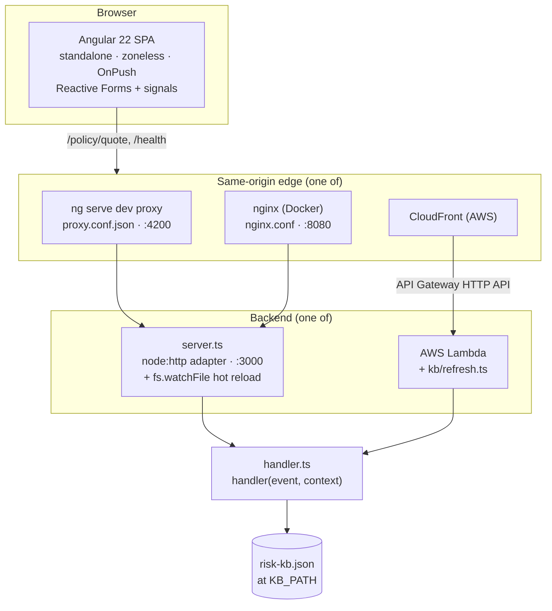

The browser always calls **relative URLs** (`/policy/quote`). Whatever sits in front of the backend (the Angular dev proxy, nginx or CloudFront) forwards them, so the frontend has no environment-specific configuration and no CORS preflight in normal use. The handler still sends CORS headers on every response, for callers on other origins.

### 2.3 Backend components

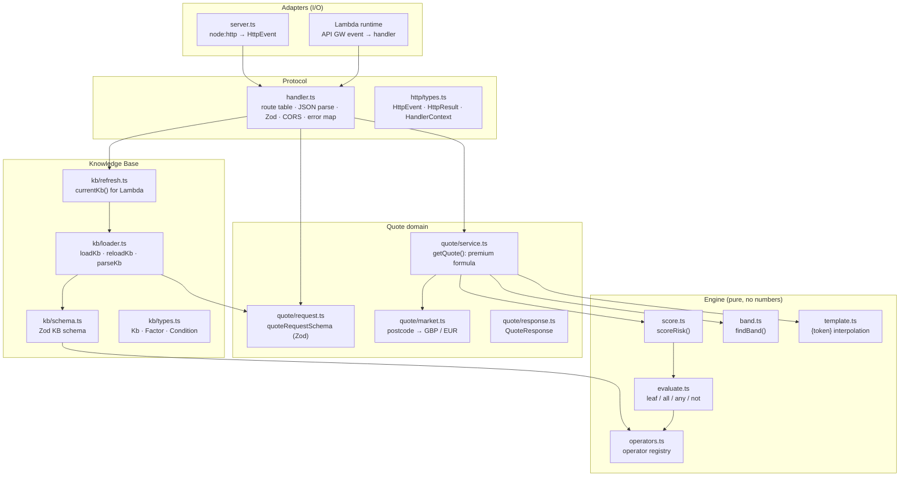

**Layer rules**

| Layer | May depend on | Must not |
|---|---|---|
| `server.ts` | `handler`, `kb/loader`, `kb/refresh` | Route, validate or score. |
| `handler.ts` | `quote/request`, `quote/service`, `kb/refresh`, `http/types` | Contain scoring numbers or KB field names. |
| `quote/service.ts` | `engine/*`, `quote/market`, KB types | Do I/O or read the clock. Only calendar and currency constants (12 months, 100 minor units) are allowed. |
| `engine/*` | KB types, `operators` | Contain numeric literals, name a request field, factor id or band id. |
| `kb/loader.ts` | `kb/schema`, `quote/request` (field whitelist) | Serve a KB it could not validate. |

**Handler routes** (`handler.ts`, a `Record<"METHOD /path", fn>`):

| Route | Handler | Result |
|---|---|---|
| `POST /policy/quote` | `postQuote` | 200 `QuoteResponse`, 400 `{ error, issues[] }` |
| `GET /health` | `getHealth` | 200 `{ status, kbVersion, schemaVersion, factorCount }` |
| `OPTIONS /policy/quote` | inline | 204 with CORS headers |
| anything else | none | 404 `{ error }` |

### 2.4 The Knowledge Base model

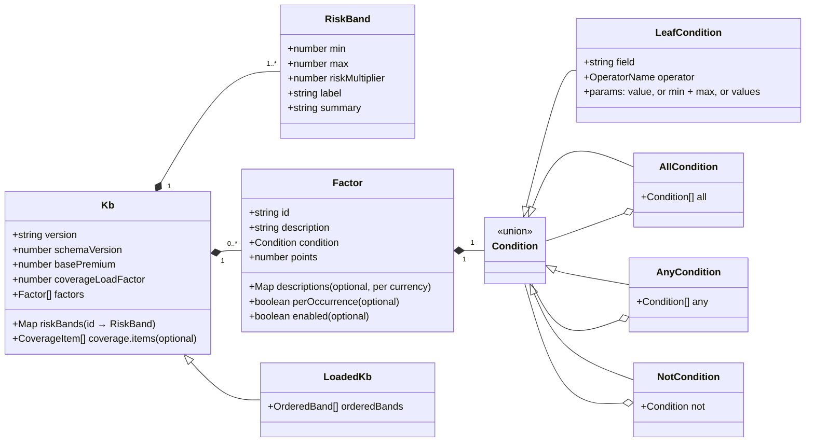

The brief's example KB is **extended, never reshaped**. Every key and value from the brief is kept, and additions are new optional keys: `schemaVersion`, per-band `riskMultiplier`, `label` and `summary`, `coverage`, `enabled`, `descriptions`, and the compound `all` / `any` / `not` groups.

**Premium formula** (in `quote/service.ts`, and nowhere else):

```text
annualPremium  = basePremium × band.riskMultiplier × coverageLoadFactor
monthlyPremium = annualPremium / 12          (rounded to 2 dp only at the response boundary)
```

**What the loader validates** (`parseKb`, in this order, with each problem naming its JSON path):

1. The file is valid JSON.
2. `schemaVersion` is in `supportedSchemaVersions` (currently `[1]`).
3. The shape matches the Zod schema, including each operator's own params.
4. Factor ids are unique.
5. Bands, sorted by `min`, start at 0 and are contiguous, and summary templates use only known tokens (`score`, `factorCount`, `label`).
6. Every `condition.field` is a request field that is actually scored (so not `customerName`), and `perOccurrence` is only used on numeric fields.

### 2.5 Engine internals

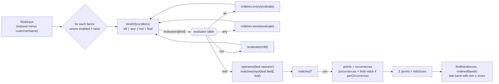

The **operator registry** (`engine/operators.ts`) is the only place operators exist. Each entry pairs a Zod schema for its params with a `matches` function. The KB schema validates leaves through the registry and the evaluator dispatches through it, so adding an operator means adding one entry.

| Operator | Params | Semantics |
|---|---|---|
| `eq`, `neq` | `value` | Strict equality or inequality. |
| `gt`, `gte`, `lt`, `lte` | `value` (number) | Numeric comparison. A non-number never matches. |
| `between` | `min`, `max` | Inclusive at both ends. |
| `outside_range` | `min`, `max` | Exclusive: `< min` or `> max`. |
| `in` | `values[]` | Any value in the list. |
| `starts_with` | `values[]` (strings) | Case-insensitive prefix. |

**Worked example.** `backend/requests/high-risk.json` (age 80, Flat, £900,000, LS1 4AP, 2 claims) matches five factors:

| Factor | Why | Points |
|---|---|---|
| `age_young_elderly` | 80 is outside 25–75 | 20 |
| `previous_claims_low` | 2 is between 1 and 2, `perOccurrence` | 15 × 2 = 30 |
| `property_type_flat` | Flat | 10 |
| `property_value_high` | 900,000 > 750,000 | 25 |
| `flat_high_value` | Flat **and** > 500,000 | 35 |
| **Total** | | **120 → HIGH_RISK (61–999)** |

The premium is then 300 × 2.2 × 1.2 = **£792.00 a year**, or **£66.00 a month**, in GBP because LS1 4AP is a UK postcode.

### 2.6 Frontend architecture

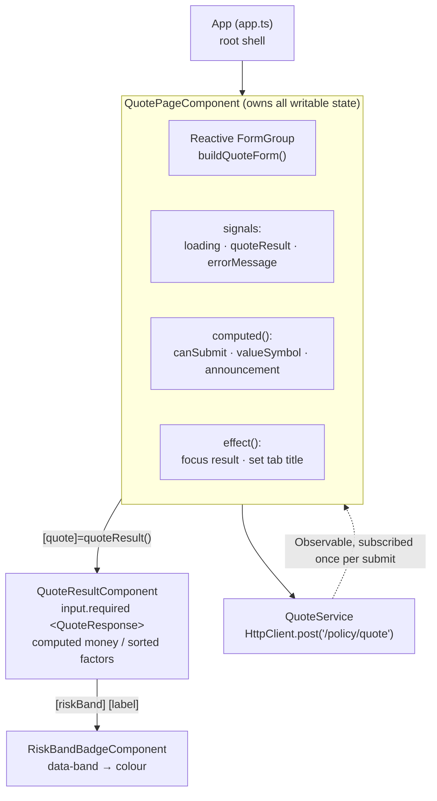

The page moves through a small state machine. Only `submit()` and its subscription write the signals.

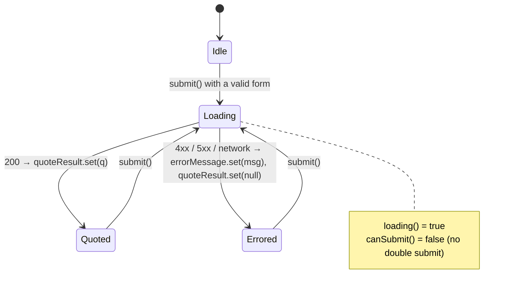

**Rules that apply to every frontend change**

- Standalone components, zoneless change detection and `OnPush` everywhere. There are no NgModules.
- No `BehaviorSubject` or `Subject` for UI state. Signals only.
- Reactive Forms, not Signal Forms. RxJS `HttpClient`, not `httpResource`. These override the upstream Angular skill defaults, as the brief requires.
- Hand-written CSS only. No Material, PrimeNG, Bootstrap or Tailwind.
- All risk wording (factor descriptions, badge label, summary) comes from the API response, which gets it from the KB. None of it is hard-coded in the UI.

### 2.7 Runtime topologies

| | Local (`npm start`) | Docker Compose | AWS (reference, §8) |
|---|---|---|---|
| UI served by | `ng serve` on :4200 | nginx on :8080 | S3 + CloudFront |
| `/policy`, `/health` forwarded by | `proxy.conf.json` | `nginx.conf` | CloudFront behaviours → API Gateway |
| Backend host | `tsx src/server.ts` on :3000 | `node dist/server.js` (non-root) | Lambda `handler.handler` |
| KB location | `../risk-kb.json` | repo root bind-mounted read-only at `/app/kb` | bundled in the zip, or EFS `/mnt/kb` |
| KB change goes live | `fs.watchFile`, about 0.5 s | `fs.watchFile` through the mount | redeploy (bundled) or `KB_REFRESH_SECONDS` (EFS) |

### 2.8 Error model

| Status | Body | Raised by | Logged |
|---|---|---|---|
| 400 | `{ error: "Request body must be a JSON object" }` | missing or malformed JSON | no |
| 400 | `{ error: "Validation failed", issues: [{ field, message }] }` | Zod: every bad field at once | no |
| 404 | `{ error: "Not found" }` | no route in the table | no |
| 500 | `{ error: "Quote engine unavailable", requestId }` | any throw inside a route (in practice an unreadable KB) | stderr JSON `{ requestId, error }` |

Internal details never reach the client. The `requestId` (the Lambda `awsRequestId`, or a UUID locally) ties the 500 the customer sees to the log line.

---

## 3. Use cases

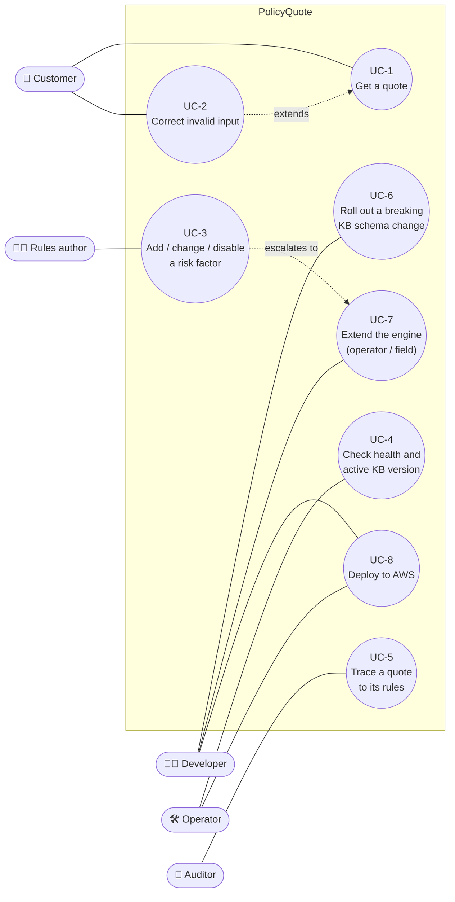

### UC-1: Get a quote

| | |
|---|---|
| **Actor** | Customer |
| **Goal** | See a monthly and annual premium, the risk band, and why. |
| **Preconditions** | The backend is up with a valid KB loaded. |
| **Trigger** | The customer submits the quote form. |
| **Main flow** | 1. The customer enters name, age, property type, property value, postcode and previous claims. 2. As the postcode is typed, the value field's currency symbol switches (£ for a UK postcode, € for an Eircode). 3. The customer presses **Get quote**, and the button disables while `loading()` is true. 4. The backend validates the request, scores it against the KB, finds the band and prices the premium. 5. The UI shows the premium, the band badge, the summary, the applied factors (highest first), the premium breakdown and the KB version. Focus moves to the result and the tab title shows the premium. |
| **Alternate flows** | 4a. Validation fails: see UC-2. 4b. The KB can't be read: the backend returns 500 with a `requestId`, and the UI shows "We couldn't get a quote right now… (reference …)". 4c. The network fails: the UI shows "We couldn't reach the quote service…". In every error case no stale premium is shown. |
| **Postconditions** | The quote carries `kbVersion`. Nothing is persisted. |
| **Business rules** | Premium = base × band multiplier × load factor. `customerName` is never scored or logged. Amounts are never converted between currencies. |

### UC-2: Correct invalid input

| | |
|---|---|
| **Actor** | Customer |
| **Goal** | Find out which fields are wrong and fix them. |
| **Main flow** | 1. A field is touched and is invalid, so an inline error appears, with `aria-invalid` and `aria-describedby` set. 2. The submit button stays disabled while the form is invalid. 3. If a request reaches the backend anyway (for example from an API client), the 400 response lists every bad field in `issues[]`, and the UI names each one using the form's labels. |
| **Business rules** | The form validators mirror `quoteRequestSchema` field by field: age 18–120 (whole number), value > 0, claims 0–20 (whole number), a UK postcode or Eircode, and a name of 1–100 characters after trimming. |

### UC-3: Add, change or disable a risk factor

| | |
|---|---|
| **Actor** | Rules author (an underwriter working through a developer, or through the `kb-factor` skill) |
| **Goal** | Change pricing rules without a code change or a restart. |
| **Preconditions** | The rule can be expressed with the existing request fields and operators. |
| **Main flow** | 1. The author states the rule in plain English, for example "Flat AND over £500k is +35". 2. The rule is restated in KB terms and any ambiguity ("over" or "at least") is resolved. 3. `risk-kb.json` is edited and `version` bumped in one save. 4. A scenario fixture is added or updated in `backend/test/scenarios/`. 5. `npm test` passes. 6. The running backend reloads, `/health` shows the new `kbVersion`, and a curl or the UI lists the factor. 7. The change is logged in `AGENT_LOG.md`. |
| **Alternate flows** | 3a. The edit is invalid: the backend logs the JSON path, keeps serving the last good KB, and step 3 is repeated. 2a. The rule needs a new field or operator: escalate to UC-7. |
| **Postconditions** | No file under `backend/src` or `frontend/src` changed. New quotes carry the new `kbVersion`. |

### UC-4: Check health and the active KB version

| | |
|---|---|
| **Actor** | Operator, the Docker `HEALTHCHECK`, a load balancer or monitoring |
| **Main flow** | `GET /health` returns `{ status: "ok", kbVersion, schemaVersion, factorCount }`. |
| **Use** | Confirm that a KB publish has gone live. Use it as a liveness probe. |

### UC-5: Trace a quote to its rules

| | |
|---|---|
| **Actor** | Auditor or complaints handler |
| **Main flow** | 1. Read `kbVersion` from the stored quote. 2. Find the KB at that version in git history (or in the versioned S3 release bucket on AWS). 3. Re-run the request against that KB, which gives the same result because scoring is deterministic. `appliedFactors` shows each factor's contribution. |

### UC-6: Roll out a breaking KB schema change

| | |
|---|---|
| **Actor** | Developer |
| **Main flow (expand/contract)** | 1. Ship code that reads both schema N and N+1 (add N+1 to `supportedSchemaVersions`). 2. Publish the N+1 KB. 3. Once nothing publishes N any more, remove N support in a later release. |
| **Safety** | A KB with an unsupported `schemaVersion` is rejected with a clear message, and the last good KB keeps serving (`kb/versioning.spec.ts`). |

### UC-7: Extend the engine with a new operator or request field

| | |
|---|---|
| **Actor** | Developer (the `risk-engine` or `lambda-handler` skill) |
| **New operator** | Add one entry to the `operators` registry with a params schema and a `matches` function, plus unit tests in `operators.spec.ts`. The schema and evaluator pick it up automatically. |
| **New request field** | Add it to `quoteRequestSchema`, `frontend/src/app/models/quote.ts`, the form and its validators, and the template. KB conditions can then reference it, because the loader's field whitelist comes from the schema. |

### UC-8: Deploy to AWS

See [§8](#8-deploying-to-aws-with-terraform).

---

## 4. Runtime interaction flows

### 4.1 Get a quote (happy path, local)

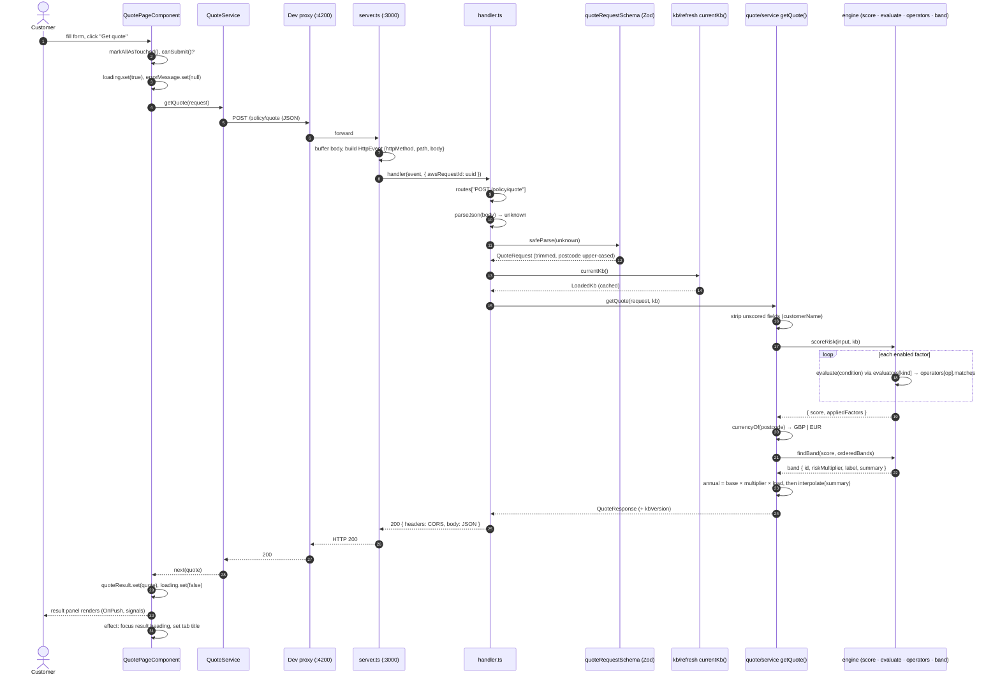

### 4.2 Validation failure (400)

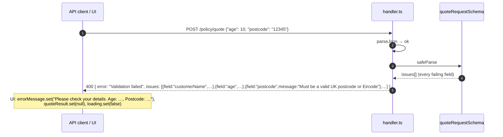

A body that isn't JSON at all (empty, blank or malformed) stops earlier with `400 { error: "Request body must be a JSON object" }`, and the scoring code is never reached.

### 4.3 Server startup and KB hot reload

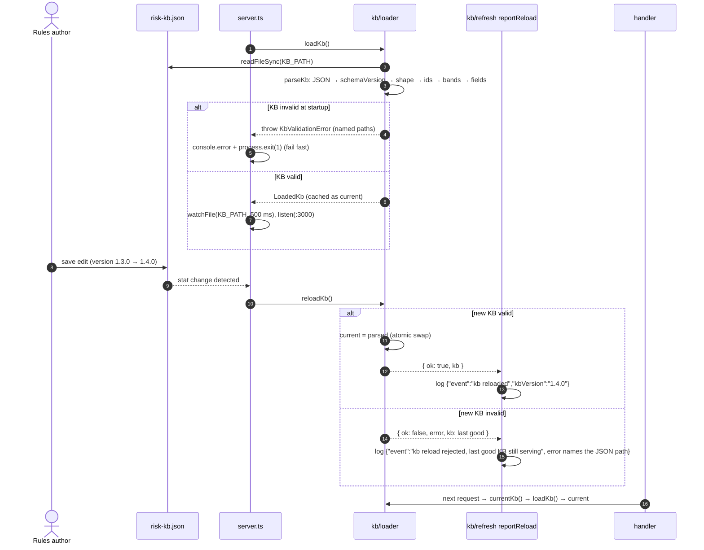

Stat polling (`fs.watchFile`) is used rather than `fs.watch` (inotify) on purpose. It also works across Docker bind mounts, and with editors that save by atomic rename. That is also why Compose mounts the repo **directory** rather than the single file.

### 4.4 KB unavailable (500)

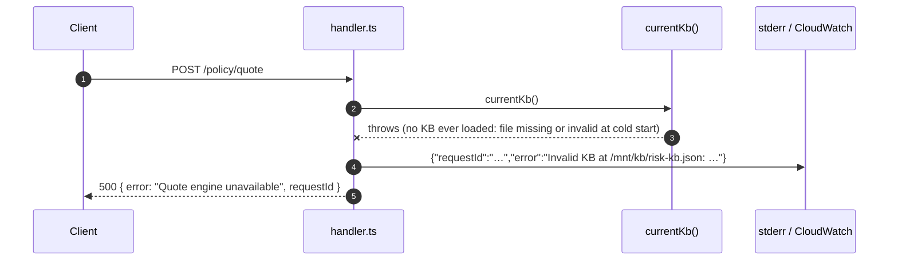

Locally this can only happen if the KB was never loaded, because `server.ts` refuses to start with a bad KB. On Lambda, the first `loadKb()` happens on the first request, so a bad KB at cold start produces 500s until a valid KB is published. The CI validation step in §8.8 prevents this.

### 4.5 AWS Lambda: cold start and warm-container KB refresh

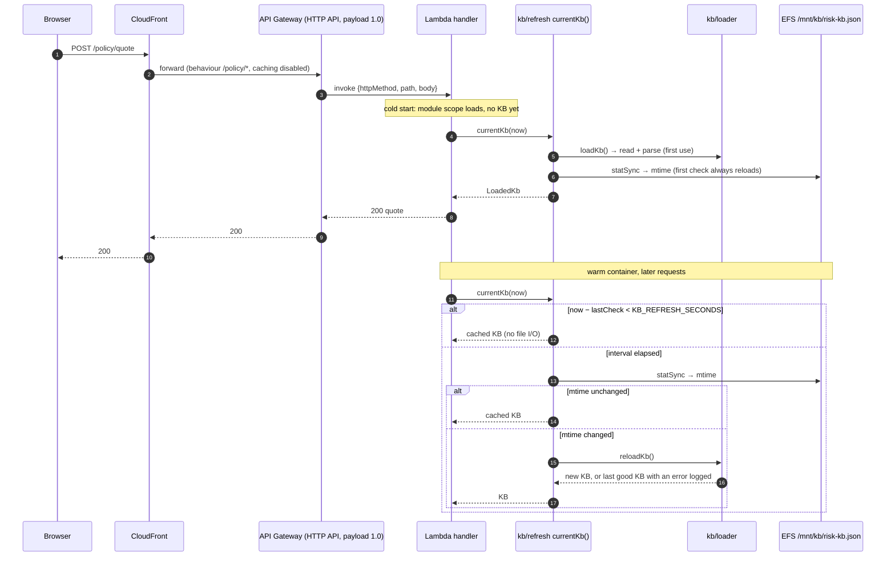

### 4.6 AWS: publishing a new rule set (EFS mode)

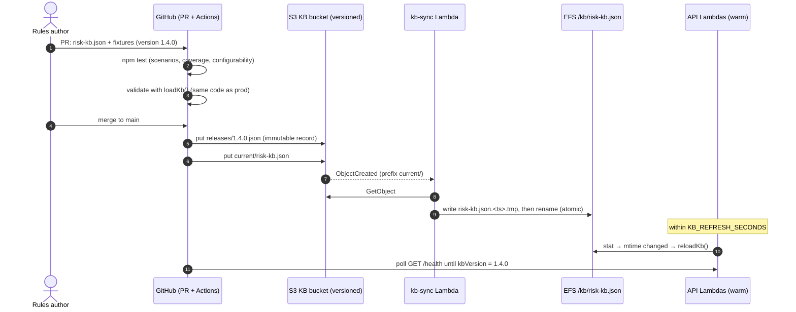

**Rollback** is the same flow with an older file: `aws s3 cp s3://…/releases/1.3.0.json s3://…/current/risk-kb.json`.

### 4.7 Changing a rule with the `kb-factor` skill

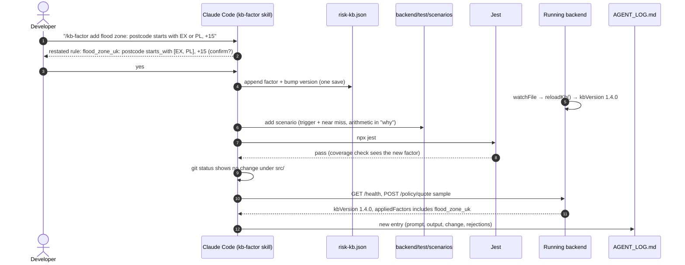

---

## 5. Setup guide

### 5.1 Prerequisites

| Tool | Version | Needed for |
|---|---|---|
| Node.js | 22 or 24 LTS (`engines: >=22`) | everything |
| npm | bundled with Node | installs, scripts |
| Git | any recent | cloning |
| Docker + Compose v2 | optional | `docker compose up` |
| Terraform | ≥ 1.10 | only for §8 |
| AWS CLI v2 | optional | only for §8 |

No global Angular CLI is needed. The frontend uses its local copy through `npm start`, and `npx @angular/cli` for anything else.

### 5.2 Clone and run

```bash
git clone <repo-url> policy_quote_engine
cd policy_quote_engine
npm start            # installs backend + frontend deps on first run (npm ci), then starts both
```

Open **http://localhost:4200**. The backend is on **http://localhost:3000**.

`scripts/start.mjs` prefixes the two services' output with `[backend]` and `[frontend]`. Ctrl+C stops both, and if either one exits (for example because a port is in use) the other is stopped too.

Each service also starts on its own:

```bash
npm --prefix backend install && npm --prefix backend start     # :3000
npm --prefix frontend install && npm --prefix frontend start   # :4200, proxied to :3000
```

Or run the whole thing in containers:

```bash
docker compose up --build        # UI on http://localhost:8080 (not 4200)
docker compose down
```

### 5.3 Verify the install

```bash
curl -s localhost:3000/health
# {"status":"ok","kbVersion":"1.3.0","schemaVersion":1,"factorCount":7}

curl -s -XPOST localhost:3000/policy/quote -H 'Content-Type: application/json' \
  -d @backend/requests/high-risk.json
# riskScore 120, HIGH_RISK, annualPremium 792, currency GBP
```

| Sample (`backend/requests/`) | Postcode | Score | Band | Annual |
|---|---|---|---|---|
| `standard.json` | SW1A 1AA (UK) | 10 | STANDARD | £360 |
| `elevated.json` | H91 E2K3 (IE) | 30 | ELEVATED | €540 |
| `high-risk.json` | LS1 4AP (UK) | 120 | HIGH_RISK | £792 |
| `compound.json` | D04 C932 (IE) | 45 | ELEVATED | €540 |
| `flood-zone.json` | D01 F5P2 (IE) | 15 | STANDARD | €360 |

### 5.4 Tests and quality gates

```bash
cd backend
npm test                          # Jest: engine, loader, handler, scenarios, configurability, coverage
npx jest src/handler.spec.ts      # one file
npx jest -t "returns 400"         # one test by name
npm run typecheck                 # tsc --noEmit
npm run lint                      # no-explicit-any, switch ban, no-magic-numbers in engine/
npm run build                     # tsc -p tsconfig.build.json → dist/

cd ../frontend
npm test                          # Vitest: form validators, signal state, result panel, badge
npm run lint
npm run build                     # → dist/frontend/browser
```

**Backend test layout**

| Path | What it proves |
|---|---|
| `src/**/*.spec.ts` | Unit tests: each operator, the evaluator, band lookup, templates, the loader's six checks, the handler's status codes, the refresh logic, versioning. |
| `test/scenarios/*.json` + `scenarios.spec.ts` | One JSON fixture per KB factor (plus `bands.json`), run with `test.each` against the **real** `risk-kb.json`. Expected scores are worked out by hand. |
| `test/configurability/*.json` + `configurability.spec.ts` | The same engine against patched in-memory KBs: adding, changing, removing and OR-ing factors needs no code. |
| `test/coverage.spec.ts` | Fails if any KB factor or band has no scenario. |

Run the quality gates from the repo root. **Each must print nothing:**

```bash
grep -rnE --exclude='*.spec.ts' --exclude='test-kb.ts' '\b[0-9]+\.[0-9]+\b|\b([2-9]|[1-9][0-9]+)\b' backend/src/engine | grep -vE '^\S+:[0-9]+:\s*(//|/?\*)'
grep -rnE 'fetch\(|https?\.request|axios|openai|anthropic' backend/src
grep -rnE 'BehaviorSubject|\bSubject\b|NgModule' frontend/src/app
grep -nE 'material|primeng|bootstrap|tailwind' frontend/package.json
```

### 5.5 Editor setup

- Use the workspace TypeScript version so `strict` settings match the CLI.
- `frontend/.vscode/` has launch and task configurations for `ng serve` and the tests.
- ESLint flat configs are `backend/eslint.config.mjs` and `frontend/eslint.config.js`.
- Prettier settings are in `frontend/.prettierrc`.

---

## 6. Development workflow

### 6.1 Where does my change go?

| I want to… | Edit | Skill | Must also update |
|---|---|---|---|
| Add, change, disable or remove a risk factor | `risk-kb.json` only | `kb-factor` | a scenario fixture, `version` |
| Change band ranges, multipliers, base premium or wording | `risk-kb.json` | `kb-factor` / `risk-engine` | the `bands.json` scenario and any moved fixtures |
| Add an operator | `backend/src/engine/operators.ts` | `risk-engine` | `operators.spec.ts`, README operator table |
| Add a request field | `quote/request.ts`, `frontend/src/app/models/quote.ts`, `quote-form.ts`, template | `lambda-handler` + `angular-signals-component` | fixtures' `_base.json`, sample requests |
| Add an endpoint | the `routes` table in `handler.ts` | `lambda-handler` | `handler.spec.ts`, dev proxy, `nginx.conf` |
| Change how the result looks | `frontend/src/app/quote/*`, `risk-band-badge/*` | `angular-signals-component` | component specs |
| Change the KB's *shape* in a breaking way | `kb/types.ts`, `kb/schema.ts`, `supportedSchemaVersions` | `risk-engine` | expand/contract, §UC-6 |

### 6.2 The agent workflow

This repository is built with Claude Code and project skills in `.claude/skills/`. For each significant change:

1. Prompt with the skill name, the files and a definition of done.
2. Review the output against the skill's reject table.
3. Run the phase's "Done when" checks (tests and quality gates).
4. Log it with `bash .claude/skills/agent-log/scripts/new_entry.sh "Title"` and fill in every `TODO` in the same turn. The **Rejected / corrected** field matters most.
5. Commit with `(log #N)` in the message.

### 6.3 Coding conventions

- No `any`, including in `catch` clauses and `JSON.parse` results. Parse to `unknown` and narrow.
- No `switch`, and no if/else chains over routes, operators, factor ids or band ids. Use a `Record` lookup.
- No Express, Fastify, Koa or Hono, and no `@types/aws-lambda` or `aws-sdk` in the backend.
- No outbound network calls from `backend/src`.
- Comments explain *why*, an invariant or a limit. They don't restate the name.

---

## 7. Configuration reference

| Variable | Used by | Default | Meaning |
|---|---|---|---|
| `PORT` | `server.ts` | `3000` | Port the local adapter listens on. |
| `KB_PATH` | `kb/loader.ts` | `<cwd>/../risk-kb.json` | Absolute or relative path to the KB. **Set it explicitly anywhere except a repo checkout** (Docker sets `/app/kb/risk-kb.json`, and Lambda must set it too). |
| `KB_REFRESH_SECONDS` | `kb/refresh.ts` | unset (off) | In a long-lived Lambda container, re-check `KB_PATH` at most once per interval and reload when the mtime changes. Unset, `0`, negative or non-numeric turns it off. Not needed under `server.ts`, which watches the file. |
| `NODE_ENV` | runtime | unset | `production` in images. |

The frontend has no environment files. It always calls relative URLs.

---

## 8. Deploying to AWS with Terraform

> [!IMPORTANT]
> **This is a reference deployment path. The project itself is not deployed.** `specs/tech-stack.md` keeps the exercise local-only, so no infrastructure files are committed. The Terraform below is complete and passes `terraform validate` (Terraform 1.16, AWS provider 6.x). To adopt it, copy the files into `infra/terraform/` and update `specs/tech-stack.md` in the same change.

### 8.1 Target architecture

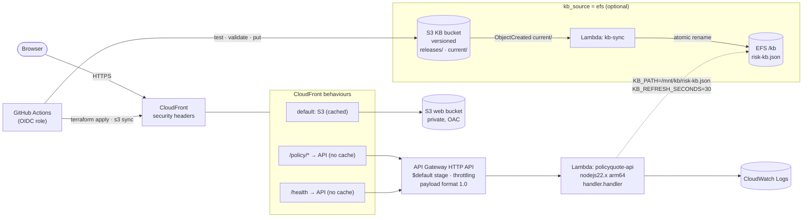

**Why this shape**

| Choice | Reason |
|---|---|
| Lambda + API Gateway **HTTP API** | The backend already exports `handler(event, context)`. HTTP API with **payload format 1.0** delivers exactly the `{ httpMethod, path, body }` shape `http/types.ts` expects, and a `$default` stage keeps paths unprefixed. No code change is needed. |
| One `$default` route | `handler.ts` owns routing and returns its own 404. Duplicating the route table in API Gateway would mean two tables to keep in step. |
| CloudFront in front of both S3 and the API | The browser stays same-origin, as with the dev proxy and nginx, so the relative `/policy/quote` URL works unchanged and there are no CORS preflights. |
| API behaviours use `CachingDisabled` | Every quote must be priced by the live KB. |
| arm64 Lambda | Cheaper per millisecond. The package has no native modules, so it runs unchanged. |
| No NAT gateway, even in EFS mode | The backend makes no outbound calls, and that is a hard rule of the project. The sync function reaches S3 through a free gateway endpoint. |

### 8.2 Choosing how the KB is delivered

| | `kb_source = "bundled"` (default) | `kb_source = "efs"` |
|---|---|---|
| Where the KB lives | `/var/task/kb/risk-kb.json` inside the zip | EFS, mounted at `/mnt/kb` |
| How a rule change goes live | Rebuild the zip and `terraform apply` (a new Lambda version, typically live in seconds) | `aws s3 cp` to `current/`, live within `KB_REFRESH_SECONDS` with no deploy |
| Extra infrastructure | none | VPC (2 private subnets, no NAT), EFS, access point, S3 KB bucket, kb-sync Lambda, S3 gateway endpoint |
| Cold start | Fastest | Slightly slower (VPC attachment and the EFS mount) |
| Good for | dev, demos, low change rates | production, where underwriters change rules often and every release is audited in S3 |

Both modes serve the KB through the same `loadKb()` / `reloadKb()` validation as local runs.

### 8.3 Prerequisites and state bootstrap

1. An AWS account and credentials with rights to create IAM, Lambda, API Gateway, S3, CloudFront, CloudWatch and (in EFS mode) VPC and EFS resources.
2. Terraform ≥ 1.10, AWS CLI v2 and Node 22.
3. Create the state bucket once. Every other resource is created by Terraform.

```bash
export AWS_REGION=eu-west-2
STATE_BUCKET=policyquote-tfstate-$(aws sts get-caller-identity --query Account --output text)
aws s3api create-bucket --bucket "$STATE_BUCKET" --region "$AWS_REGION" \
  --create-bucket-configuration LocationConstraint="$AWS_REGION"
aws s3api put-bucket-versioning --bucket "$STATE_BUCKET" --versioning-configuration Status=Enabled
aws s3api put-public-access-block --bucket "$STATE_BUCKET" --public-access-block-configuration \
  BlockPublicAcls=true,IgnorePublicAcls=true,BlockPublicPolicy=true,RestrictPublicBuckets=true
```

Put that bucket name into `backend "s3"` in `versions.tf`, or pass it with `terraform init -backend-config="bucket=$STATE_BUCKET"`.

### 8.4 Build the Lambda package

The Lambda needs the compiled `dist/` output, production dependencies (only `zod`) and, in bundled mode, the KB. From the repo root:

```bash
cd backend
npm ci
npm test && npm run typecheck && npm run lint
npm run build                                   # → backend/dist (handler.js at the root)

rm -rf .lambda && mkdir -p .lambda/kb
cp -R dist/. .lambda/
cp package.json package-lock.json .lambda/
(cd .lambda && npm ci --omit=dev --ignore-scripts)
cp ../risk-kb.json .lambda/kb/risk-kb.json      # used by kb_source=bundled; harmless in efs mode
cd ..
```

Add `backend/.lambda/` and `infra/terraform/.build/` to `.gitignore`. The package is about 8 MB unzipped.

Check the package locally before deploying. This invokes the handler with the exact event API Gateway will send:

```bash
cd backend/.lambda && KB_PATH=$PWD/kb/risk-kb.json node -e '
const { handler } = require("./handler.js");
handler({ version: "1.0", httpMethod: "GET", path: "/health", body: null }, { awsRequestId: "local" })
  .then((r) => console.log(r.statusCode, r.body));'
# 200 {"status":"ok","kbVersion":"1.3.0","schemaVersion":1,"factorCount":7}
```

### 8.5 The Terraform configuration

Layout:

```text
infra/terraform/
├── versions.tf     providers, remote state
├── variables.tf    inputs (region, environment, kb_source, throttling…)
├── lambda.tf       API Lambda, IAM role, log group
├── api.tf          HTTP API, integration, $default route + stage, permission
├── frontend.tf     S3 web bucket, OAC, CloudFront (S3 + API origins), bucket policy
├── kb_efs.tf       kb_source = "efs" only: VPC, EFS, KB bucket, kb-sync Lambda
└── outputs.tf      app_url, api_url, bucket names, distribution id
```

<details>
<summary><b><code>versions.tf</code></b></summary>

```hcl
terraform {
  required_version = ">= 1.10"

  required_providers {
    aws     = { source = "hashicorp/aws", version = "~> 6.0" }
    archive = { source = "hashicorp/archive", version = "~> 2.7" }
  }

  # Remote state with native S3 locking (Terraform >= 1.10). Create the bucket once, by hand (see §9.3).
  backend "s3" {
    bucket       = "REPLACE-ME-policyquote-tfstate"
    key          = "policyquote/terraform.tfstate"
    region       = "eu-west-2"
    use_lockfile = true
    encrypt      = true
  }
}

provider "aws" {
  region = var.region
  default_tags {
    tags = { Project = "policyquote", Environment = var.environment, ManagedBy = "terraform" }
  }
}
```

</details>

<details>
<summary><b><code>variables.tf</code></b></summary>

```hcl
variable "region" {
  description = "AWS region for the API, the Lambda and the buckets."
  type        = string
  default     = "eu-west-2" # London
}

variable "environment" {
  description = "Environment name, used in resource names (dev, staging, prod)."
  type        = string
  default     = "dev"
}

variable "kb_source" {
  description = "bundled: the KB ships inside the Lambda zip (a KB change is a redeploy). efs: the KB lives on EFS and is published through S3 without a redeploy."
  type        = string
  default     = "bundled"
  validation {
    condition     = contains(["bundled", "efs"], var.kb_source)
    error_message = "kb_source must be \"bundled\" or \"efs\"."
  }
}

variable "kb_refresh_seconds" {
  description = "efs mode only: how often a warm Lambda re-checks KB_PATH (backend/src/kb/refresh.ts)."
  type        = number
  default     = 30
}

variable "lambda_package_dir" {
  description = "Directory holding the built Lambda package (see §9.4 'Build the Lambda package')."
  type        = string
  default     = "../../backend/.lambda"
}

variable "lambda_memory_mb" {
  type    = number
  default = 256
}

variable "api_throttle_rate" {
  description = "Steady-state requests per second allowed by API Gateway."
  type        = number
  default     = 20
}

variable "api_throttle_burst" {
  type    = number
  default = 40
}

variable "log_retention_days" {
  type    = number
  default = 30
}
```

</details>

<details>
<summary><b><code>lambda.tf</code></b></summary>

```hcl
locals {
  name    = "policyquote-${var.environment}"
  use_efs = var.kb_source == "efs"
}

data "archive_file" "api" {
  type        = "zip"
  source_dir  = var.lambda_package_dir
  output_path = "${path.module}/.build/api.zip"
}

resource "aws_iam_role" "api" {
  name = "${local.name}-api"
  assume_role_policy = jsonencode({
    Version   = "2012-10-17"
    Statement = [{ Effect = "Allow", Action = "sts:AssumeRole", Principal = { Service = "lambda.amazonaws.com" } }]
  })
}

resource "aws_iam_role_policy_attachment" "api_logs" {
  role       = aws_iam_role.api.name
  policy_arn = "arn:aws:iam::aws:policy/service-role/AWSLambdaBasicExecutionRole"
}

resource "aws_iam_role_policy_attachment" "api_vpc" {
  count      = local.use_efs ? 1 : 0
  role       = aws_iam_role.api.name
  policy_arn = "arn:aws:iam::aws:policy/service-role/AWSLambdaVPCAccessExecutionRole"
}

# The API only ever reads the KB.
resource "aws_iam_role_policy_attachment" "api_efs_read" {
  count      = local.use_efs ? 1 : 0
  role       = aws_iam_role.api.name
  policy_arn = "arn:aws:iam::aws:policy/AmazonElasticFileSystemClientReadOnlyAccess"
}

resource "aws_cloudwatch_log_group" "api" {
  name              = "/aws/lambda/${local.name}-api"
  retention_in_days = var.log_retention_days
}

resource "aws_lambda_function" "api" {
  function_name    = "${local.name}-api"
  role             = aws_iam_role.api.arn
  runtime          = "nodejs22.x"
  architectures    = ["arm64"]
  handler          = "handler.handler" # dist/handler.js → export const handler
  filename         = data.archive_file.api.output_path
  source_code_hash = data.archive_file.api.output_base64sha256
  memory_size      = var.lambda_memory_mb
  timeout          = 10

  environment {
    variables = {
      NODE_ENV = "production"
      # KB_PATH must be set: the loader's default (cwd/../risk-kb.json) only makes sense in the repo.
      KB_PATH            = local.use_efs ? "/mnt/kb/risk-kb.json" : "/var/task/kb/risk-kb.json"
      KB_REFRESH_SECONDS = local.use_efs ? tostring(var.kb_refresh_seconds) : "0"
    }
  }

  dynamic "vpc_config" {
    for_each = local.use_efs ? [1] : []
    content {
      subnet_ids         = aws_subnet.private[*].id
      security_group_ids = [aws_security_group.lambda[0].id]
    }
  }

  dynamic "file_system_config" {
    for_each = local.use_efs ? [1] : []
    content {
      arn              = aws_efs_access_point.kb[0].arn
      local_mount_path = "/mnt/kb"
    }
  }

  depends_on = [aws_cloudwatch_log_group.api, aws_efs_mount_target.kb]
}
```

</details>

<details>
<summary><b><code>api.tf</code></b></summary>

```hcl
resource "aws_apigatewayv2_api" "http" {
  name          = "${local.name}-api"
  protocol_type = "HTTP"
  # No cors_configuration: the browser reaches the API through CloudFront on the same origin,
  # and handler.ts already sets CORS headers on every response for direct callers.
}

# Payload format 1.0 gives the handler the { httpMethod, path, body } shape that http/types.ts expects.
resource "aws_apigatewayv2_integration" "lambda" {
  api_id                 = aws_apigatewayv2_api.http.id
  integration_type       = "AWS_PROXY"
  integration_uri        = aws_lambda_function.api.invoke_arn
  payload_format_version = "1.0"
}

# One catch-all route: handler.ts owns the route table and returns its own 404.
resource "aws_apigatewayv2_route" "default" {
  api_id    = aws_apigatewayv2_api.http.id
  route_key = "$default"
  target    = "integrations/${aws_apigatewayv2_integration.lambda.id}"
}

resource "aws_cloudwatch_log_group" "api_access" {
  name              = "/aws/apigateway/${local.name}-api"
  retention_in_days = var.log_retention_days
}

# The $default stage keeps paths unprefixed ("/policy/quote", not "/prod/policy/quote").
resource "aws_apigatewayv2_stage" "default" {
  api_id      = aws_apigatewayv2_api.http.id
  name        = "$default"
  auto_deploy = true

  default_route_settings {
    throttling_rate_limit  = var.api_throttle_rate
    throttling_burst_limit = var.api_throttle_burst
  }

  access_log_settings {
    destination_arn = aws_cloudwatch_log_group.api_access.arn
    format = jsonencode({
      requestId        = "$context.requestId"
      ip               = "$context.identity.sourceIp"
      method           = "$context.httpMethod"
      path             = "$context.path"
      status           = "$context.status"
      latencyMs        = "$context.responseLatency"
      integrationError = "$context.integrationErrorMessage"
    })
  }
}

resource "aws_lambda_permission" "apigw" {
  statement_id  = "AllowApiGatewayInvoke"
  action        = "lambda:InvokeFunction"
  function_name = aws_lambda_function.api.function_name
  principal     = "apigateway.amazonaws.com"
  source_arn    = "${aws_apigatewayv2_api.http.execution_arn}/*/*"
}
```

</details>

<details>
<summary><b><code>frontend.tf</code></b></summary>

```hcl
data "aws_caller_identity" "current" {}

resource "aws_s3_bucket" "web" {
  bucket = "${local.name}-web-${data.aws_caller_identity.current.account_id}"
}

resource "aws_s3_bucket_public_access_block" "web" {
  bucket                  = aws_s3_bucket.web.id
  block_public_acls       = true
  block_public_policy     = true
  ignore_public_acls      = true
  restrict_public_buckets = true
}

resource "aws_cloudfront_origin_access_control" "web" {
  name                              = "${local.name}-web"
  origin_access_control_origin_type = "s3"
  signing_behavior                  = "always"
  signing_protocol                  = "sigv4"
}

data "aws_cloudfront_cache_policy" "optimized" { name = "Managed-CachingOptimized" }
data "aws_cloudfront_cache_policy" "disabled" { name = "Managed-CachingDisabled" }
data "aws_cloudfront_origin_request_policy" "all_but_host" { name = "Managed-AllViewerExceptHostHeader" }
data "aws_cloudfront_response_headers_policy" "security" { name = "Managed-SecurityHeadersPolicy" }

# One origin for the browser: CloudFront plays the part nginx.conf plays under Docker.
resource "aws_cloudfront_distribution" "web" {
  enabled             = true
  comment             = local.name
  default_root_object = "index.html"
  price_class         = "PriceClass_100"
  http_version        = "http2and3"

  origin {
    origin_id                = "web"
    domain_name              = aws_s3_bucket.web.bucket_regional_domain_name
    origin_access_control_id = aws_cloudfront_origin_access_control.web.id
  }

  origin {
    origin_id   = "api"
    domain_name = replace(aws_apigatewayv2_api.http.api_endpoint, "https://", "")
    custom_origin_config {
      http_port              = 80
      https_port             = 443
      origin_protocol_policy = "https-only"
      origin_ssl_protocols   = ["TLSv1.2"]
    }
  }

  default_cache_behavior {
    target_origin_id           = "web"
    viewer_protocol_policy     = "redirect-to-https"
    allowed_methods            = ["GET", "HEAD"]
    cached_methods             = ["GET", "HEAD"]
    compress                   = true
    cache_policy_id            = data.aws_cloudfront_cache_policy.optimized.id
    response_headers_policy_id = data.aws_cloudfront_response_headers_policy.security.id
  }

  # Quotes are never cached: every request reaches the Lambda and is priced by the live KB.
  ordered_cache_behavior {
    path_pattern             = "/policy/*"
    target_origin_id         = "api"
    viewer_protocol_policy   = "https-only"
    allowed_methods          = ["DELETE", "GET", "HEAD", "OPTIONS", "PATCH", "POST", "PUT"]
    cached_methods           = ["GET", "HEAD"]
    cache_policy_id          = data.aws_cloudfront_cache_policy.disabled.id
    origin_request_policy_id = data.aws_cloudfront_origin_request_policy.all_but_host.id
  }

  ordered_cache_behavior {
    path_pattern             = "/health"
    target_origin_id         = "api"
    viewer_protocol_policy   = "https-only"
    allowed_methods          = ["GET", "HEAD"]
    cached_methods           = ["GET", "HEAD"]
    cache_policy_id          = data.aws_cloudfront_cache_policy.disabled.id
    origin_request_policy_id = data.aws_cloudfront_origin_request_policy.all_but_host.id
  }

  restrictions {
    geo_restriction {
      restriction_type = "none"
    }
  }

  viewer_certificate {
    cloudfront_default_certificate = true
  }
}

resource "aws_s3_bucket_policy" "web" {
  bucket = aws_s3_bucket.web.id
  policy = jsonencode({
    Version = "2012-10-17"
    Statement = [{
      Sid       = "AllowCloudFrontRead"
      Effect    = "Allow"
      Principal = { Service = "cloudfront.amazonaws.com" }
      Action    = "s3:GetObject"
      Resource  = "${aws_s3_bucket.web.arn}/*"
      Condition = { StringEquals = { "AWS:SourceArn" = aws_cloudfront_distribution.web.arn } }
    }]
  })
}
```

</details>

<details>
<summary><b><code>kb_efs.tf</code></b> (only active when <code>kb_source = "efs"</code>)</summary>

```hcl
# Only when kb_source = "efs": the KB on a shared file system, published through S3, live without a redeploy.
# The API Lambda makes no outbound calls, so the VPC has no NAT gateway and no internet route at all.

data "aws_availability_zones" "available" { state = "available" }

resource "aws_vpc" "kb" {
  count                = local.use_efs ? 1 : 0
  cidr_block           = "10.40.0.0/16"
  enable_dns_support   = true
  enable_dns_hostnames = true
  tags                 = { Name = "${local.name}-kb" }
}

resource "aws_subnet" "private" {
  count             = local.use_efs ? 2 : 0
  vpc_id            = aws_vpc.kb[0].id
  cidr_block        = cidrsubnet(aws_vpc.kb[0].cidr_block, 8, count.index)
  availability_zone = data.aws_availability_zones.available.names[count.index]
  tags              = { Name = "${local.name}-private-${count.index}" }
}

resource "aws_route_table" "private" {
  count  = local.use_efs ? 1 : 0
  vpc_id = aws_vpc.kb[0].id
}

resource "aws_route_table_association" "private" {
  count          = local.use_efs ? 2 : 0
  subnet_id      = aws_subnet.private[count.index].id
  route_table_id = aws_route_table.private[0].id
}

# The KB sync function reads S3 from inside the VPC through this free gateway endpoint.
resource "aws_vpc_endpoint" "s3" {
  count             = local.use_efs ? 1 : 0
  vpc_id            = aws_vpc.kb[0].id
  service_name      = "com.amazonaws.${var.region}.s3"
  vpc_endpoint_type = "Gateway"
  route_table_ids   = [aws_route_table.private[0].id]
}

resource "aws_security_group" "lambda" {
  count  = local.use_efs ? 1 : 0
  name   = "${local.name}-lambda"
  vpc_id = aws_vpc.kb[0].id
  egress {
    description = "NFS to EFS and HTTPS to the S3 gateway endpoint; there is no internet route"
    from_port   = 0
    to_port     = 0
    protocol    = "-1"
    cidr_blocks = ["0.0.0.0/0"]
  }
}

resource "aws_security_group" "efs" {
  count  = local.use_efs ? 1 : 0
  name   = "${local.name}-efs"
  vpc_id = aws_vpc.kb[0].id
  ingress {
    description     = "NFS from the Lambdas"
    from_port       = 2049
    to_port         = 2049
    protocol        = "tcp"
    security_groups = [aws_security_group.lambda[0].id]
  }
}

resource "aws_efs_file_system" "kb" {
  count     = local.use_efs ? 1 : 0
  encrypted = true
  tags      = { Name = "${local.name}-kb" }
}

resource "aws_efs_mount_target" "kb" {
  count           = local.use_efs ? 2 : 0
  file_system_id  = aws_efs_file_system.kb[0].id
  subnet_id       = aws_subnet.private[count.index].id
  security_groups = [aws_security_group.efs[0].id]
}

resource "aws_efs_access_point" "kb" {
  count          = local.use_efs ? 1 : 0
  file_system_id = aws_efs_file_system.kb[0].id
  posix_user {
    uid = 1000
    gid = 1000
  }
  root_directory {
    path = "/kb"
    creation_info {
      owner_uid   = 1000
      owner_gid   = 1000
      permissions = "755"
    }
  }
}

# --- The KB release bucket: versioned, so every published rule set is kept and a rollback is a copy. ---

resource "aws_s3_bucket" "kb" {
  count  = local.use_efs ? 1 : 0
  bucket = "${local.name}-kb-${data.aws_caller_identity.current.account_id}"
}

resource "aws_s3_bucket_versioning" "kb" {
  count  = local.use_efs ? 1 : 0
  bucket = aws_s3_bucket.kb[0].id
  versioning_configuration { status = "Enabled" }
}

resource "aws_s3_bucket_public_access_block" "kb" {
  count                   = local.use_efs ? 1 : 0
  bucket                  = aws_s3_bucket.kb[0].id
  block_public_acls       = true
  block_public_policy     = true
  ignore_public_acls      = true
  restrict_public_buckets = true
}

# --- The KB sync function: S3 current/risk-kb.json → EFS /kb/risk-kb.json, by atomic rename. ---

data "archive_file" "kb_sync" {
  type        = "zip"
  output_path = "${path.module}/.build/kb-sync.zip"
  source {
    filename = "index.mjs"
    content  = <<-JS
      import { S3Client, GetObjectCommand } from '@aws-sdk/client-s3';
      import { rename, writeFile } from 'node:fs/promises';

      const s3 = new S3Client({});
      const target = process.env.KB_TARGET;

      export const handler = async (event) => {
        for (const record of event.Records) {
          const Bucket = record.s3.bucket.name;
          const Key = decodeURIComponent(record.s3.object.key.replace(/\+/g, ' '));
          const body = await (await s3.send(new GetObjectCommand({ Bucket, Key }))).Body.transformToString('utf8');
          JSON.parse(body); // cheap guard only; CI has already run the real loader (parseKb) and the scenario tests
          const tmp = target + '.' + Date.now() + '.tmp';
          await writeFile(tmp, body, 'utf8');
          await rename(tmp, target); // atomic: the API never reads a half-written KB
          console.log(JSON.stringify({ event: 'kb published', key: Key, versionId: record.s3.object.versionId }));
        }
      };
    JS
  }
}

resource "aws_iam_role" "kb_sync" {
  count = local.use_efs ? 1 : 0
  name  = "${local.name}-kb-sync"
  assume_role_policy = jsonencode({
    Version   = "2012-10-17"
    Statement = [{ Effect = "Allow", Action = "sts:AssumeRole", Principal = { Service = "lambda.amazonaws.com" } }]
  })
}

resource "aws_iam_role_policy_attachment" "kb_sync_vpc" {
  count      = local.use_efs ? 1 : 0
  role       = aws_iam_role.kb_sync[0].name
  policy_arn = "arn:aws:iam::aws:policy/service-role/AWSLambdaVPCAccessExecutionRole"
}

resource "aws_iam_role_policy_attachment" "kb_sync_efs" {
  count      = local.use_efs ? 1 : 0
  role       = aws_iam_role.kb_sync[0].name
  policy_arn = "arn:aws:iam::aws:policy/AmazonElasticFileSystemClientReadWriteAccess"
}

resource "aws_iam_role_policy" "kb_sync_s3" {
  count = local.use_efs ? 1 : 0
  role  = aws_iam_role.kb_sync[0].id
  policy = jsonencode({
    Version   = "2012-10-17"
    Statement = [{ Effect = "Allow", Action = ["s3:GetObject", "s3:GetObjectVersion"], Resource = "${aws_s3_bucket.kb[0].arn}/current/*" }]
  })
}

resource "aws_lambda_function" "kb_sync" {
  count            = local.use_efs ? 1 : 0
  function_name    = "${local.name}-kb-sync"
  role             = aws_iam_role.kb_sync[0].arn
  runtime          = "nodejs22.x"
  architectures    = ["arm64"]
  handler          = "index.handler"
  filename         = data.archive_file.kb_sync.output_path
  source_code_hash = data.archive_file.kb_sync.output_base64sha256
  timeout          = 30

  environment {
    variables = { KB_TARGET = "/mnt/kb/risk-kb.json" }
  }

  vpc_config {
    subnet_ids         = aws_subnet.private[*].id
    security_group_ids = [aws_security_group.lambda[0].id]
  }

  file_system_config {
    arn              = aws_efs_access_point.kb[0].arn
    local_mount_path = "/mnt/kb"
  }

  depends_on = [aws_efs_mount_target.kb]
}

resource "aws_lambda_permission" "kb_sync_s3" {
  count         = local.use_efs ? 1 : 0
  statement_id  = "AllowS3Invoke"
  action        = "lambda:InvokeFunction"
  function_name = aws_lambda_function.kb_sync[0].function_name
  principal     = "s3.amazonaws.com"
  source_arn    = aws_s3_bucket.kb[0].arn
}

resource "aws_s3_bucket_notification" "kb" {
  count  = local.use_efs ? 1 : 0
  bucket = aws_s3_bucket.kb[0].id
  lambda_function {
    lambda_function_arn = aws_lambda_function.kb_sync[0].arn
    events              = ["s3:ObjectCreated:*"]
    filter_prefix       = "current/"
  }
  depends_on = [aws_lambda_permission.kb_sync_s3]
}

# Seeds the first KB so the API has rules on its first cold start. After that the KB pipeline owns the
# object (§9.6), so Terraform ignores later content changes rather than rolling the rules back.
resource "aws_s3_object" "kb_seed" {
  count        = local.use_efs ? 1 : 0
  bucket       = aws_s3_bucket.kb[0].id
  key          = "current/risk-kb.json"
  source       = "${path.module}/../../risk-kb.json"
  content_type = "application/json"
  lifecycle { ignore_changes = [source, etag] }
  depends_on = [aws_s3_bucket_notification.kb]
}
```

</details>

<details>
<summary><b><code>outputs.tf</code></b></summary>

```hcl
output "app_url" {
  description = "Open this in a browser."
  value       = "https://${aws_cloudfront_distribution.web.domain_name}"
}

output "api_url" {
  description = "Direct API Gateway URL, for smoke tests."
  value       = aws_apigatewayv2_api.http.api_endpoint
}

output "web_bucket" { value = aws_s3_bucket.web.bucket }
output "distribution_id" { value = aws_cloudfront_distribution.web.id }
output "kb_bucket" { value = local.use_efs ? aws_s3_bucket.kb[0].bucket : null }
```

</details>

**Environments.** Use one state key per environment, for example `-backend-config="key=policyquote/prod.tfstate"`, together with a `prod.tfvars`:

```hcl
# infra/terraform/prod.tfvars
environment        = "prod"
kb_source          = "efs"
kb_refresh_seconds = 30
lambda_memory_mb   = 512
api_throttle_rate  = 100
api_throttle_burst = 200
log_retention_days = 90
```

### 8.6 Deploy

```bash
# 1. Backend package (§8.4)
# 2. Infrastructure
cd infra/terraform
terraform init -backend-config="bucket=$STATE_BUCKET"
terraform plan  -out tfplan                     # add -var-file=prod.tfvars for prod
terraform apply tfplan

# 3. Frontend
cd ../..
npm --prefix frontend ci
npm --prefix frontend run build                 # → frontend/dist/frontend/browser
WEB_BUCKET=$(terraform -chdir=infra/terraform output -raw web_bucket)
DIST_ID=$(terraform -chdir=infra/terraform output -raw distribution_id)

# Hashed assets can be cached forever; index.html must always be revalidated.
aws s3 sync frontend/dist/frontend/browser "s3://$WEB_BUCKET" --delete \
  --exclude index.html --cache-control "public,max-age=31536000,immutable"
aws s3 cp frontend/dist/frontend/browser/index.html "s3://$WEB_BUCKET/index.html" \
  --cache-control "no-cache"
aws cloudfront create-invalidation --distribution-id "$DIST_ID" --paths "/index.html"

# 4. Smoke test
APP=$(terraform -chdir=infra/terraform output -raw app_url)
curl -s "$APP/health"
curl -s -XPOST "$APP/policy/quote" -H 'Content-Type: application/json' -d @backend/requests/high-risk.json
```

A first CloudFront deployment takes a few minutes before `app_url` responds. The app has no client-side router, so `default_root_object = "index.html"` is enough and no SPA error-page rewrite is needed. A rewrite would also turn the API's own 404s into HTML.

### 8.7 Publishing and rolling back rules

**Bundled mode.** Merge the KB change, rebuild the package (§8.4) and `terraform apply`. `source_code_hash` changes, so Lambda publishes the new code and new containers load the new KB.

**EFS mode.** No deploy is needed:

```bash
KB_BUCKET=$(terraform -chdir=infra/terraform output -raw kb_bucket)
VERSION=$(node -p 'require("./risk-kb.json").version')

# Validate with the production loader first. A bad KB must never reach current/.
(cd backend && KB_PATH=../risk-kb.json npx tsx -e "import { loadKb } from './src/kb/loader'; console.log('KB ok', loadKb().version)")

aws s3 cp risk-kb.json "s3://$KB_BUCKET/releases/$VERSION.json"   # immutable audit record
aws s3 cp risk-kb.json "s3://$KB_BUCKET/current/risk-kb.json"     # triggers kb-sync → EFS

# Wait for warm containers to pick it up (≤ KB_REFRESH_SECONDS)
until curl -s "$APP/health" | grep -q "\"kbVersion\":\"$VERSION\""; do sleep 5; done
```

**Rollback:** `aws s3 cp "s3://$KB_BUCKET/releases/1.3.0.json" "s3://$KB_BUCKET/current/risk-kb.json"`.

Even if an invalid file reaches EFS, warm containers reject it and keep serving the last good KB (§4.3). Only *new* cold containers would fail (§4.4). That is why validation runs before the upload, not after.

### 8.8 CI/CD with GitHub Actions

Use OIDC federation rather than long-lived keys. Create an IAM role trusted by `token.actions.githubusercontent.com` for this repository and grant it the Terraform permissions (§8.3), plus `s3:PutObject` on the web and KB buckets and `cloudfront:CreateInvalidation`.

```yaml
# .github/workflows/deploy.yml
name: deploy
on:
  push:
    branches: [main]
permissions:
  id-token: write
  contents: read
concurrency: deploy-${{ github.ref }}

jobs:
  test:
    runs-on: ubuntu-latest
    steps:
      - uses: actions/checkout@v4
      - uses: actions/setup-node@v4
        with: { node-version: 22 }
      - run: npm --prefix backend ci && npm --prefix backend test && npm --prefix backend run lint && npm --prefix backend run typecheck
      - run: npm --prefix frontend ci && npm --prefix frontend test -- --watch=false && npm --prefix frontend run lint
      - name: Validate the KB with the production loader
        working-directory: backend
        run: KB_PATH=../risk-kb.json npx tsx -e "import { loadKb } from './src/kb/loader'; console.log('KB ok', loadKb().version)"

  deploy:
    needs: test
    runs-on: ubuntu-latest
    environment: prod
    steps:
      - uses: actions/checkout@v4
      - uses: actions/setup-node@v4
        with: { node-version: 22 }
      - uses: aws-actions/configure-aws-credentials@v4
        with:
          role-to-assume: ${{ secrets.AWS_DEPLOY_ROLE_ARN }}
          aws-region: eu-west-2
      - uses: hashicorp/setup-terraform@v3
      - name: Build the Lambda package
        run: |
          cd backend && npm ci && npm run build
          rm -rf .lambda && mkdir -p .lambda/kb && cp -R dist/. .lambda/
          cp package.json package-lock.json .lambda/ && (cd .lambda && npm ci --omit=dev --ignore-scripts)
          cp ../risk-kb.json .lambda/kb/risk-kb.json
      - name: Terraform apply
        working-directory: infra/terraform
        run: |
          terraform init -backend-config="bucket=${{ vars.TF_STATE_BUCKET }}" -backend-config="key=policyquote/prod.tfstate"
          terraform apply -auto-approve -var-file=prod.tfvars
      - name: Publish the frontend
        run: |
          npm --prefix frontend ci && npm --prefix frontend run build
          WEB=$(terraform -chdir=infra/terraform output -raw web_bucket)
          DIST=$(terraform -chdir=infra/terraform output -raw distribution_id)
          aws s3 sync frontend/dist/frontend/browser "s3://$WEB" --delete --exclude index.html --cache-control "public,max-age=31536000,immutable"
          aws s3 cp frontend/dist/frontend/browser/index.html "s3://$WEB/index.html" --cache-control "no-cache"
          aws cloudfront create-invalidation --distribution-id "$DIST" --paths "/index.html"
      - name: Publish the KB (efs mode)
        run: |
          KB=$(terraform -chdir=infra/terraform output -raw kb_bucket)
          V=$(node -p 'require("./risk-kb.json").version')
          aws s3 cp risk-kb.json "s3://$KB/releases/$V.json"
          aws s3 cp risk-kb.json "s3://$KB/current/risk-kb.json"
      - name: Smoke test
        run: |
          APP=$(terraform -chdir=infra/terraform output -raw app_url)
          V=$(node -p 'require("./risk-kb.json").version')
          for i in $(seq 1 24); do curl -sf "$APP/health" | grep -q "\"kbVersion\":\"$V\"" && exit 0; sleep 5; done; exit 1
```

A KB-only change can use a lighter workflow triggered on `paths: [risk-kb.json, backend/test/scenarios/**]` that runs the `test` job and then only the "Publish the KB" and "Smoke test" steps.

### 8.9 Operating it

**Observability**

| Signal | Where | Suggested alarm |
|---|---|---|
| Handler errors (500s) | Lambda log group: `{"requestId", "error"}` lines on stderr | Metric filter on `"Quote engine unavailable"` or `$.requestId` > 0 in 5 min |
| Rejected KB reloads | Lambda log group: `"kb reload rejected"` | Any occurrence, since it means a bad KB reached the file |
| Successful KB reloads | `{"event":"kb reloaded","kbVersion":…}` | none (informational) |
| Score above the top band | `{"warning":"score above top band max"}` | Any occurrence, since the KB's top band needs widening |
| Latency, 5xx, throttles | API Gateway access logs and metrics | p99 latency, 5xx rate, `Throttles` |
| Lambda health | `Errors`, `Duration`, `ConcurrentExecutions` | `Errors` > 0 |

A CloudWatch Logs Insights query for recent failures:

```text
fields @timestamp, requestId, error
| filter ispresent(requestId) and ispresent(error)
| sort @timestamp desc
| limit 50
```

**Security hardening checklist**

- [ ] Add AWS WAF to the CloudFront distribution (managed common rule set plus a rate-based rule). It needs a `us-east-1` provider alias for the web ACL.
- [ ] Use a custom domain with an ACM certificate in `us-east-1`, and set `minimum_protocol_version = "TLSv1.2_2021"`.
- [ ] Stop direct access to the `execute-api` URL, which bypasses CloudFront. Either attach a custom domain and set `disable_execute_api_endpoint = true`, or have CloudFront send a secret origin header and check it with a Lambda authorizer.
- [ ] Narrow the `Access-Control-Allow-Origin: *` header in `handler.ts` if you don't want cross-origin callers.
- [ ] Set Lambda reserved concurrency to cap cost and blast radius.
- [ ] Turn on S3 server access logs or CloudTrail data events for the KB bucket, so there is an audit trail of every rule publish.
- [ ] `customerName` is never logged by the backend. Keep it that way; it is personal data.

**Cost.** At low volume this runs almost entirely within the free tier. Lambda, API Gateway and CloudFront are billed per request, and S3 costs pennies. EFS mode adds EFS storage (negligible for a few KB of JSON) and no NAT gateway cost. There is no always-on compute.

**Teardown**

```bash
aws s3 rm "s3://$WEB_BUCKET" --recursive
# efs mode: the KB bucket is versioned, so empty every version (or add force_destroy = true first)
terraform -chdir=infra/terraform destroy
```

---

## 9. Troubleshooting

| Symptom | Likely cause | Fix |
|---|---|---|
| Backend exits at startup with `Invalid KB at …` | The KB fails one of the six checks | Read the listed JSON paths and fix `risk-kb.json`. |
| An edit to the KB doesn't take effect | The edit is invalid; look for `kb reload rejected` in the backend log | Fix the path named in the log. The last good KB is still serving. |
| Docker doesn't see KB edits | A single file was bind-mounted instead of the directory | Use the Compose file as provided (it mounts `./` at `/app/kb`). |
| `EADDRINUSE :3000` or `:4200` | Something is already running | Stop it, or `PORT=3001 npm --prefix backend start` (and update `proxy.conf.json`). |
| UI says "We couldn't reach the quote service" | Backend not running, or the dev proxy isn't forwarding | `curl localhost:3000/health`. Start the backend. |
| The same KB gives a different premium in € and £ | It doesn't. Amounts are not converted, only labelled | Expected behaviour (see README "UK and Ireland"). |
| Lambda returns `{"error":"Not found"}` for every path | The API stage isn't `$default`, so `path` includes the stage prefix | Use the `$default` stage as in `api.tf`. |
| Lambda returns 500 on every request after a deploy | `KB_PATH` not set, or the KB is missing from the package or EFS | Check the Lambda environment, the `.lambda/kb/` folder, or that `current/risk-kb.json` was synced (kb-sync logs). |
| Lambda reads `undefined` for `httpMethod` | The integration uses payload format 2.0 | Set `payload_format_version = "1.0"`. |
| A KB publish in EFS mode never goes live | `KB_REFRESH_SECONDS` is 0, or kb-sync failed | Check the Lambda environment and the `kb-sync` log group. |

---

## 10. Appendix: file map

```text
risk-kb.json                         the Knowledge Base (rules, bands, premium inputs)
package.json, scripts/start.mjs      root npm start: both services
docker-compose.yml                   whole app on :8080, KB mounted live

backend/
  src/handler.ts                     Lambda entry: route table, parse, Zod, CORS, error map
  src/server.ts                      node:http adapter + fs.watchFile hot reload
  src/http/types.ts                  HttpEvent / HttpResult / HandlerContext (API Gateway subset)
  src/quote/request.ts               quoteRequestSchema: the request contract
  src/quote/market.ts                UK postcode / Eircode → GBP / EUR
  src/quote/service.ts               getQuote(): the premium formula
  src/quote/response.ts              QuoteResponse type
  src/quote/summary-tokens.ts        tokens allowed in band summaries
  src/engine/operators.ts            operator registry
  src/engine/evaluate.ts             condition tree evaluator (lookup table by node kind)
  src/engine/score.ts                scoreRisk(): matched factors and points
  src/engine/band.ts                 findBand()
  src/engine/template.ts             {token} interpolation
  src/kb/types.ts                    KB interfaces (source of truth)
  src/kb/schema.ts                   Zod KB schema (validates through the registry)
  src/kb/loader.ts                   loadKb / reloadKb / parseKb, supportedSchemaVersions
  src/kb/refresh.ts                  currentKb(): KB_REFRESH_SECONDS for Lambda
  test/scenarios/                    one JSON fixture per factor, plus bands
  test/configurability/              patched-KB proofs
  requests/                          sample request bodies
  Dockerfile                         multi-stage, non-root, HEALTHCHECK

frontend/
  src/app/app.config.ts              zoneless, HttpClient
  src/app/models/quote.ts            request/response types (mirror the backend)
  src/app/quote/quote-form.ts        six-field reactive form + validators
  src/app/quote/quote-page.component signals: loading, quoteResult, errorMessage
  src/app/quote/quote-result.component  result panel (computed display state)
  src/app/quote/quote.service.ts     POST /policy/quote
  src/app/quote/money.ts             currency formatting
  src/app/risk-band-badge/           reusable badge (label from the KB)
  proxy.conf.json                    dev proxy to :3000
  nginx.conf, Dockerfile             production image

specs/                               mission, tech stack, roadmap, review prep
.claude/skills/                      project skills used to build and change the app
AGENT_LOG.md                         agent interaction log
SOLUTION.md                          design summary (≤ 300 words)
```
